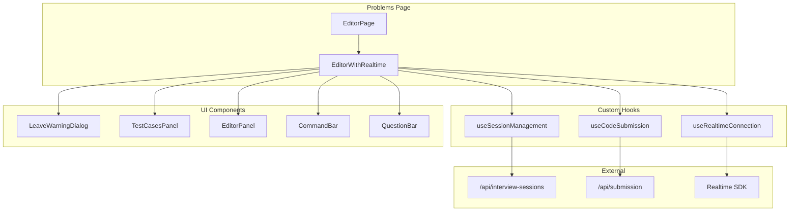

# Design Document: Problems Page Refactor

## Overview

This design describes the decomposition of the monolithic `EditorWithRealtime` component (~927 lines) into smaller, focused components and custom hooks. The refactoring follows React best practices for separation of concerns, making the codebase more maintainable, testable, and easier to understand.

## Architecture



## Components and Interfaces

### Custom Hooks

#### 1. useSessionManagement

Handles session lifecycle: validation, creation, navigation warnings, and abandonment.

```typescript
interface UseSessionManagementOptions {
  sessionId: string;
  questionUri: string;
}

interface UseSessionManagementReturn {
  sessionValidated: boolean;
  sessionStartedAt: string | null;
  showLeaveWarning: boolean;
  setShowLeaveWarning: (show: boolean) => void;
  handleConfirmLeave: () => Promise<void>;
  handleCancelLeave: () => void;
}

function useSessionManagement(options: UseSessionManagementOptions): UseSessionManagementReturn;
```

#### 2. useRealtimeConnection

Manages WebRTC connection, microphone handling, and turn detection.

```typescript
interface UseRealtimeConnectionOptions {
  sessionValidated: boolean;
  questionText: string;
  onTranscriptBreadcrumb: (title: string, data?: object) => void;
}

interface UseRealtimeConnectionReturn {
  sessionStatus: SessionStatus;
  micStatus: MicStatus;
  isPTTActive: boolean;
  setIsPTTActive: (active: boolean) => void;
  toggleMic: () => void;
}

function useRealtimeConnection(options: UseRealtimeConnectionOptions): UseRealtimeConnectionReturn;
```

#### 3. useCodeSubmission

Handles code submission to Judge0 and result polling.

```typescript
interface UseCodeSubmissionOptions {
  sessionId: string;
  questionUri: string;
  sessionStartedAt: string | null;
}

interface TestCaseResult {
  status: "pending" | "passed" | "failed" | "running";
  actualOutput?: string;
  stderr?: string;
}

interface UseCodeSubmissionReturn {
  testCaseResults: TestCaseResult[];
  isRunning: boolean;
  output: string;
  runCode: (code: string, language: string, starterCode: StarterCode) => Promise<void>;
}

function useCodeSubmission(options: UseCodeSubmissionOptions): UseCodeSubmissionReturn;
```

### UI Components

#### 4. LeaveWarningDialog

Displays warning when user attempts to leave an active session.

```typescript
interface LeaveWarningDialogProps {
  open: boolean;
  onOpenChange: (open: boolean) => void;
  onConfirm: () => void;
  onCancel: () => void;
}

function LeaveWarningDialog(props: LeaveWarningDialogProps): JSX.Element;
```

#### 5. TestCasesPanel

Displays test case results with expandable failure details.

```typescript
interface TestCaseMetadata {
  id: string;
  input: string;
  expected_output: string;
}

interface TestCasesPanelProps {
  visibleTestCases: TestCaseMetadata[];
  hiddenTestCases?: TestCaseMetadata[];
  results: TestCaseResult[];
  fallbackOutput?: string;
}

function TestCasesPanel(props: TestCasesPanelProps): JSX.Element;
```

#### 6. EditorPanel

Wraps Monaco editor with language selection and mic alert.

```typescript
interface EditorPanelProps {
  code: string;
  language: string;
  micStatus: MicStatus;
  onCodeChange: (code: string) => void;
  onLanguageChange: (language: string) => void;
  onRun: () => void;
  onSubmit: () => void;
}

function EditorPanel(props: EditorPanelProps): JSX.Element;
```

## Data Models

### Session State

```typescript
interface SessionState {
  id: string;
  validated: boolean;
  startedAt: string | null;
  status: "in_progress" | "completed" | "abandoned";
}
```

### Test Case Result

```typescript
type TestCaseStatus = "pending" | "passed" | "failed" | "running";

interface TestCaseResult {
  status: TestCaseStatus;
  actualOutput?: string;
  stderr?: string;
}
```

### Realtime Connection State

```typescript
type SessionStatus = "DISCONNECTED" | "CONNECTING" | "CONNECTED";
type MicStatus = "ENABLED" | "DISABLED" | "RESTRICTED";

interface RealtimeState {
  sessionStatus: SessionStatus;
  micStatus: MicStatus;
  isPTTActive: boolean;
}
```

## Correctness Properties

*A property is a characteristic or behavior that should hold true across all valid executions of a system-essentially, a formal statement about what the system should do. Properties serve as the bridge between human-readable specifications and machine-verifiable correctness guarantees.*

### Property 1: Session validation handles all failure scenarios

*For any* session validation attempt with invalid credentials (no token, expired token, invalid session ID), the useSessionManagement hook SHALL redirect to the dashboard and return sessionValidated as false.

**Validates: Requirements 1.1, 1.2**

### Property 2: Microphone status changes correctly update mute state

*For any* microphone status transition (ENABLED → DISABLED, DISABLED → ENABLED, any → RESTRICTED), the useRealtimeConnection hook SHALL call the mute function with the appropriate boolean value (true for DISABLED/RESTRICTED, false for ENABLED).

**Validates: Requirements 2.3**

### Property 3: Submission polling completes or times out

*For any* code submission with N test cases, the useCodeSubmission hook SHALL poll until all N results have a terminal status (passed/failed) OR the maximum poll attempts are reached, returning partial results in the timeout case.

**Validates: Requirements 3.2, 3.3**

### Property 4: Error responses produce error state

*For any* API error response during code submission, the useCodeSubmission hook SHALL return an error state with isRunning set to false and output containing an error message.

**Validates: Requirements 3.4**

### Property 5: Test cases panel renders correct count

*For any* test case metadata with V visible and H hidden test cases, the TestCasesPanel SHALL render exactly V + H test case items.

**Validates: Requirements 4.1**

### Property 6: Running test cases display running indicator

*For any* test case result with status "running", the TestCasesPanel SHALL display the running status indicator for that test case.

**Validates: Requirements 4.3**

### Property 7: Code changes invoke callback

*For any* code change in the EditorPanel, the onChange callback SHALL be invoked with the new code value.

**Validates: Requirements 6.2**

## Error Handling

### Session Validation Errors

- **No session token**: Redirect to dashboard immediately
- **Expired token**: Clear token from sessionStorage, redirect to dashboard
- **Invalid session**: Redirect to dashboard
- **Network error**: Display error message, allow retry

### Realtime Connection Errors

- **Connection failure**: Set sessionStatus to DISCONNECTED, log error
- **Microphone permission denied**: Set micStatus to RESTRICTED, display alert
- **Disconnection during session**: Attempt reconnection, notify user

### Code Submission Errors

- **Submission API failure**: Set output to error message, set isRunning to false
- **Polling timeout**: Return partial results, indicate timeout in output
- **Network error**: Display error message, allow retry

## Testing Strategy

### Unit Testing

Unit tests will verify specific behaviors of individual components and hooks:

- **useSessionManagement**: Test validation flow, redirect behavior, event handler registration
- **useCodeSubmission**: Test submission request format, polling logic, timeout handling
- **TestCasesPanel**: Test rendering with various test case configurations
- **LeaveWarningDialog**: Test callback invocations on user actions

### Property-Based Testing

Property-based tests will use **fast-check** library to verify universal properties:

- Generate random session validation scenarios to test redirect behavior
- Generate random mic status transitions to verify mute/unmute calls
- Generate random submission results to verify polling completion
- Generate random test case metadata to verify correct rendering count

Each property-based test will:
- Run a minimum of 100 iterations
- Be tagged with the format: `**Feature: problems-page-refactor, Property {number}: {property_text}**`
- Reference the specific correctness property from this design document
