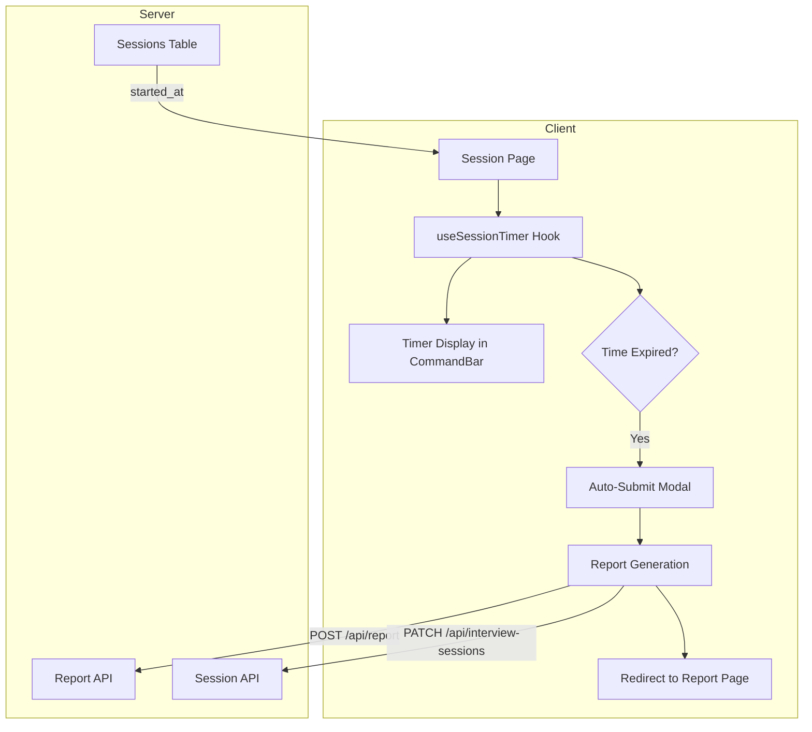

# Session Timer Design Document

## Overview

The Session Timer feature adds a countdown timer to interview sessions that displays remaining time, provides visual warnings as time runs low, and automatically submits the candidate's work when the 30-minute session expires. The timer is tamper-resistant by deriving the deadline from the server-stored `started_at` timestamp.

## Architecture



## Components and Interfaces

### 1. useSessionTimer Hook

A custom React hook that manages timer state and countdown logic.

```typescript
interface UseSessionTimerOptions {
  startedAt: Date | string
  durationMinutes?: number // defaults to 30
  onTimeExpired: () => void
}

interface UseSessionTimerReturn {
  remainingSeconds: number
  formattedTime: string // "MM:SS"
  timerStyle: 'neutral' | 'warning' | 'urgent'
  isExpired: boolean
}

function useSessionTimer(options: UseSessionTimerOptions): UseSessionTimerReturn
```

### 2. Timer Display Component

A presentational component rendered in the CommandBar.

```typescript
interface TimerDisplayProps {
  formattedTime: string
  timerStyle: 'neutral' | 'warning' | 'urgent'
}

function TimerDisplay({ formattedTime, timerStyle }: TimerDisplayProps): JSX.Element
```

### 3. TimeExpiredModal Component

A modal dialog shown when time expires.

```typescript
interface TimeExpiredModalProps {
  isOpen: boolean
  onAutoSubmit: () => void
}

function TimeExpiredModal({ isOpen, onAutoSubmit }: TimeExpiredModalProps): JSX.Element
```

### 4. Utility Functions

```typescript
// Calculate remaining seconds from started_at
function calculateRemainingSeconds(startedAt: Date, durationMinutes: number): number

// Format seconds as MM:SS
function formatTime(seconds: number): string

// Get timer style based on remaining seconds
function getTimerStyle(remainingSeconds: number): 'neutral' | 'warning' | 'urgent'
```

## Data Models

No new database tables required. The existing `sessions` table already has:
- `started_at`: timestamp when session began (used to calculate deadline)
- `ended_at`: timestamp when session ended (set on manual or auto-submit)
- `status`: session status ('in_progress', 'completed', 'abandoned')

The session validation API response already includes `started_at`:
```typescript
interface SessionValidationResponse {
  valid: boolean
  session?: {
    id: string
    user_id: string
    status: string
    started_at: string // ISO timestamp
  }
}
```

## Correctness Properties

*A property is a characteristic or behavior that should hold true across all valid executions of a system-essentially, a formal statement about what the system should do. Properties serve as the bridge between human-readable specifications and machine-verifiable correctness guarantees.*

### Property 1: Time formatting produces valid MM:SS format

*For any* non-negative integer representing remaining seconds, `formatTime` SHALL produce a string matching the pattern `MM:SS` where MM is zero-padded minutes and SS is zero-padded seconds.

**Validates: Requirements 1.1**

### Property 2: Timer style thresholds are correctly applied

*For any* remaining time value in seconds:
- If remainingSeconds > 300 (5 minutes), `getTimerStyle` SHALL return 'neutral'
- If remainingSeconds > 60 AND remainingSeconds <= 300, `getTimerStyle` SHALL return 'warning'  
- If remainingSeconds <= 60, `getTimerStyle` SHALL return 'urgent'

**Validates: Requirements 1.3, 1.4, 1.5**

### Property 3: Remaining time calculation is correct

*For any* valid `startedAt` timestamp and `currentTime`, `calculateRemainingSeconds` SHALL return `max(0, (startedAt + 30 minutes) - currentTime)` in seconds.

**Validates: Requirements 3.1, 3.2, 3.3, 4.2**

## Error Handling

| Scenario | Handling |
|----------|----------|
| `started_at` is null/undefined | Display "Loading..." and retry session validation |
| `started_at` is invalid date | Log error, treat as expired, trigger auto-submit |
| Network error during auto-submit | Show error toast, allow manual retry via "Hang Up" button |
| Report generation fails | Show error message in modal, provide retry button |
| Session already completed/abandoned | Redirect to dashboard (existing behavior) |

## Testing Strategy

### Property-Based Testing

Use `fast-check` library for property-based tests. Each property test should run a minimum of 100 iterations.

**Property tests to implement:**
1. `formatTime` produces valid MM:SS for any non-negative integer
2. `getTimerStyle` returns correct style for any remaining seconds value
3. `calculateRemainingSeconds` correctly computes remaining time for any timestamp pair

### Unit Tests

- Test edge cases: exactly 5 minutes, exactly 1 minute, 0 seconds
- Test `formatTime` with boundary values (0, 59, 60, 599, 600, 1800)
- Test timer hook initialization with various `started_at` values
- Test auto-submit flow triggers at correct time

### Integration Tests

- Verify timer persists correctly across page refresh
- Verify auto-submit triggers report generation API
- Verify redirect to report page after successful submission
